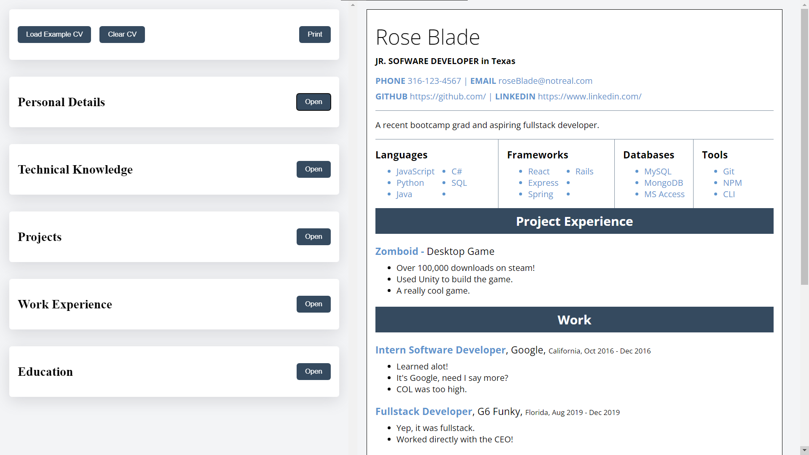
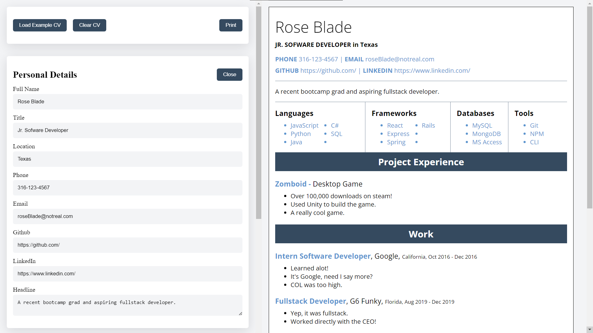
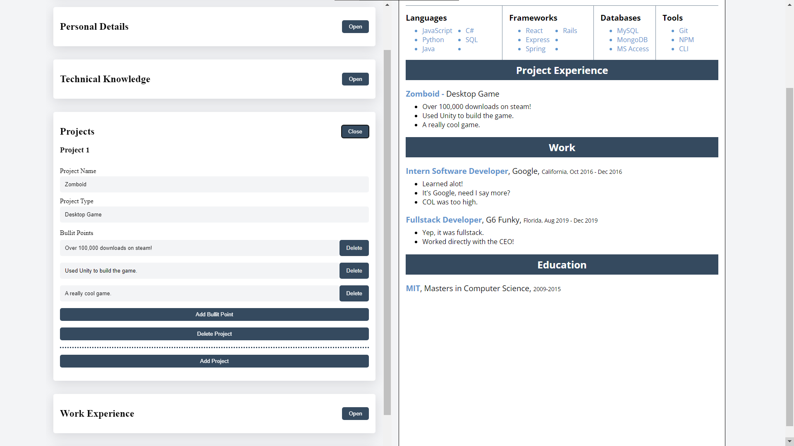

# CV Generator Application

This website lets users create a CV by simply inputing thier information.

**Live demo [link](https://rosendo-martinez.github.io/cv-application/)**. 👈

### Technology Used: 
- React
- Vite
- JavaScript
- CSS
- HTML

# Screenshots 

# Commands

To start up the local development server: `npm run dev`

To format the code: `npm run format`

To build the project: `npm run build`